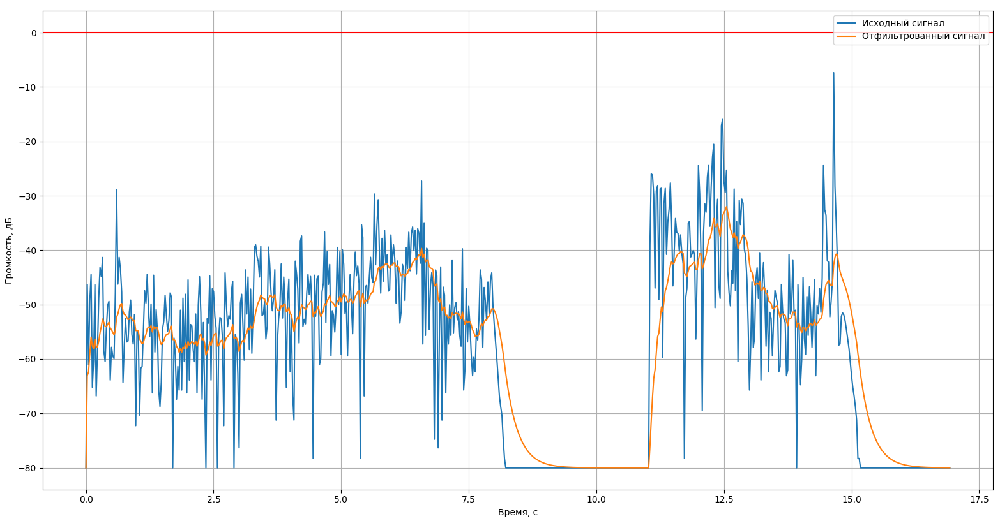
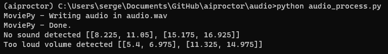
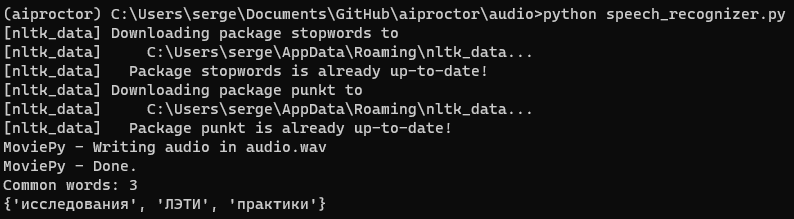

# Запуск

## Virtual environment

    python3 -m venv aiproctor

Windows

    aiproctor\Scripts\activate

Linux

    source aiproctor\Scripts\activate

## Dependencies

    pip install -r requirements.txt

## Webcam

    cd webcam

Скачать веса

    python download_weights.py

### Обнаружение телефона и человека

Зайти в директорию и запустить скрипт

    cd objects_detection
    python detect_phone_and_person.py

Если есть веб-камера, то она откроется в окне. Будут выделятся области с найденными объектами, в т.ч. человек и телефон. В консоли будут выводиться нарушения. Чтобы передать видео в `cv2.VideoCapture(0)` вместо 0 необходимо передать строку с путем до файла.

## Audio

    cd audio

В `audio/data` содержатся примеры файлов для анализа. Путь до файла указывается в `VIDEO_TO_ANALIZE_FILE_NAME`. Запуск осуществляется командой:

    python audio_process.py

В качестве результатов отображается dbfs график аудио с видеофайла:

Также в консоли отображаются нарушения:

Для запуска распознавания речи нужно поменять `VIDEO_TO_ANALIZE_FILE_NAME` на `data/some_speech.mp4`. Необходимо выполнить команду:

    python speech_recognizer.py

В `audio/texts/questions.txt` содержиться пример текста задания для сравнения с распознанными словами. Распознанный текст содержиться в `audio/texts/speech.txt`, а слова из текста в `audio/texts/words.txt`. В консоль выводятся совпадающие слова:

